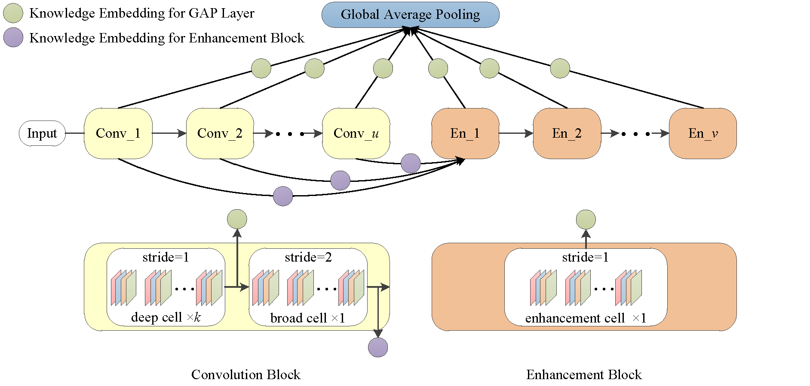

# Faster Gradient-based NAS Pipelines Using Broad Scalable Architecture




Experimental results on CIFAR-10 and ImageNet show that 1) B-DARTS delivers 5x (0.09 GPU day) and 7.9x (0.19 GPU day) faster search speed than vanilla DARTS using first and second order approximations, respectively; 2) B-PC-DARTS delivers state-of-the-art efficiency of 0.05 GPU day on CIFAR-10 and 0.19 GPU day on ImageNet; 3) The proposed CLR is effective for performance collapse issue alleviation of both B-DARTS and DARTS.
## Requirements
```
B-DARTS: Python >= 3.5.5, PyTorch == 0.3.1, torchvision == 0.2.0
B-PC-DARTS: Python >= 3.5.5, PyTorch == 0.4.0, torchvision == 0.2.0
```
NOTE: PyTorch 0.4 is not supported for B-DARTS and would lead to OOM.

## Datasets
CIFAR-10 can be automatically downloaded by torchvision, ImageNet needs to be manually downloaded (preferably to a SSD) following the instructions [here](https://github.com/pytorch/examples/tree/master/imagenet).

## Architecture search on CIFAR-10
To carry out architecture search using B-DARTS, run
```
cd B-DARTS && python train_search_b_confidence.py             # for cells on CIFAR-10 using 1nd-order approximation
cd B-DARTS && python train_search_b_confidence.py --unrolled  # for cells on CIFAR-10 using 2nd-order approximation
```
To carry out architecture search using B-PC-DARTS, run
```
cd B-PC-DARTS && python train_search_b.py             # for cells on CIFAR-10 using 1nd-order approximation
cd B-PC-DARTS && python train_search_b.py --unrolled  # for cells on CIFAR-10 using 2nd-order approximation
```

## Architecture evaluation on CIFAR-10
To evaluate our best cells of B-DARTS by training from scratch, run
```
cd B-DARTS && python train_b.py
```
To evaluate our best cells of B-PC-DARTS by training from scratch, run
```
cd B-PC-DARTS && python train_b.py
```
Customized architectures are supported through the `--arch` flag once specified in `genotypes.py`.

## Architecture search on ImageNet

To carry out architecture search on ImageNet using B-PC-DARTS, run
```
cd B-PC-DARTS && python imagenet_data_sample.py     # for sampleing subset of ImageNet for proxyless search
python train_search_imagenet_b.py                   # for architecture search on ImageNet
```

## Architecture evaluation on ImageNet
To evaluate our best cells for ImageNet by training from scratch, run
```
cd B-PC-DARTS && python train_imagenet_b.py
```

## Citation
If you use any part of this code in your research, please cite our [paper](https://arxiv.org/abs/1806.09055):
```
@article{ding2020faster,
  title={Faster Gradient-based NAS Pipelines Using Broad Scalable Architecture},
  author={Ding Zixiang, Chen Yaran, Li Nannan, and Zhao Dongbin},
  journal={arXiv preprint arXiv:},
  year={2020}
}
```
